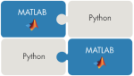
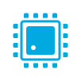
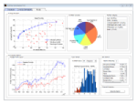
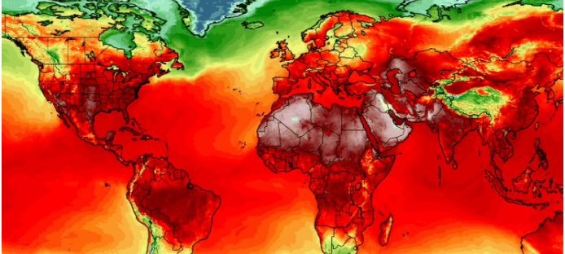
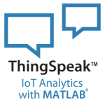

<td>

</td>

# Awesome MATLAB & Simulink Hackathons 
*The license is available in the License file within this repository*

*Copyright 2021 The MathWorks, Inc*

**Bring your ideas to life with MATLAB & Simulink!**

Taking part in a Hackathon? MathWorks is partnering with Major League Hacking (MLH) to provide you with free access to MATLAB & Simulink. MATLAB is a programming language with specialized toolboxes for Computer Vision, Deep Learning, Signal Processing, Hardware Programming, Finance PLUS lots more. If you have any questions reach out to us at <hackathon@mathworks.com>.

Below you will find: 

  * [How to get MATLAB](#how-to-get-matlab)
  * [MLH Supported Hackathons](#mlh-supported-hackathons)
  * [Other Hackathons supported by MathWorks](#other-hackathons-supported-by-mathworks)
  * [Getting started resources](#getting-started-resources)
  * [Resources by application area](#resources-by-application-area)

# How to Get MATLAB? 
***You will need a MathWorks Account***

 * If you are participating in a Major League Hacking (MLH) Hackathon and would like to access to MATLAB and Simulink, access the [complimentary license here](https://www.mathworks.com/licensecenter/classroom/dc_mlh_2). (You will need a MathWorks account)

 * If you’re a student, your university may already provide MATLAB access. [Click here](https://www.mathworks.com/academia/tah-support-program/eligibility.html) to see if you already have access. 

# MLH Supported Hackathons

Visit [this page to get a complimentary MATLAB & Simulink license](https://www.mathworks.com/licensecenter/classroom/dc_mlh_2) if you are a participant at a Major League Hacking Event. MLH Hackathons we support include:

  * [Royal Hackaway v5](https://royalhackaway.com/#/)
  * [Hacklahoma](https://hacklahoma.org/)
  * [Pearl Hacks](https://pearlhacks.com/)
  * [RevolutionUC](https://revolutionuc.com/)

# Other Hackathons supported by MathWorks

 * [Smart India Hackathon 2022](https://www.mathworks.com/academia/hackathons/smart-india.html)

# Getting Started Resources

<table>
<tbody>
<tr class="odd">

<td> <b>Learn MATLAB<b>  
</td>
<td><ul>
Complimentary 2-hour tutorials for
<li><a href="https://matlabacademy.mathworks.com/details/matlab-onramp/gettingstarted">MATLAB</a></li>
<li><a href="https://matlabacademy.mathworks.com/details/machine-learning-onramp/machinelearning">Machine Learning</a></li>
<li><a href="https://matlabacademy.mathworks.com/details/deep-learning-onramp/deeplearning">Deep Learning</a></li>
<li><a href="https://matlabacademy.mathworks.com/details/reinforcement-learning-onramp/reinforcementlearning">Reinforcement Learning</a></li>
<li><a href="https://matlabacademy.mathworks.com/details/optimization-onramp/optim">Optimization</a></li>
<li><a href="https://matlabacademy.mathworks.com/details/signal-processing-onramp/signalprocessing">Signal Processing</a></li>
<li><a href="https://matlabacademy.mathworks.com/details/image-processing-onramp/imageprocessing">Image Processing</a></li>
</ul></td>
</tr>

<tr class="odd">
<td> <b>Learn Simulink<b>  
</td>
<td><ul>
Complimentary 2-hour tutorials for
<li><a href="https://matlabacademy.mathworks.com/details/simulink-onramp/simulink">Simulink</a></li>
<li><a href="https://matlabacademy.mathworks.com/details/stateflow-onramp/stateflow">Stateflow</a></li>
<li><a href="https://matlabacademy.mathworks.com/details/control-design-onramp-with-simulink/controls">Control Design</a></li>
<li><a href="https://matlabacademy.mathworks.com/details/simscape-onramp/simscape">Simscape</a></li>
<li><a href="https://matlabacademy.mathworks.com/details/circuit-simulation-onramp/circuits">Circuit Simulation</a></li>
</ul></td>
</tr>

<tr class="odd">
<td> <b><a href="https://www.mathworks.com/academia/student-competitions/tutorials-videos.html">Videos and Tutorials for Student Projects<b>  
<td><ul>
Learn How to Use MATLAB and Simulink for Student Projects
<li><a href="https://www.mathworks.com/videos/series/perception.html">Perception</a></li>
<li><a href="https://www.mathworks.com/videos/series/robotics-education.html">Robotics</a></li>
<li><a href="https://www.mathworks.com/videos/series/student-competition-code-generation-training.html">Code generation and working with Hardware</a></li>
<li><a href="https://www.mathworks.com/videos/series/making-vehicles-and-robots-see-getting-started-with-perception-for-students.html">Making Vehicles and robots See</a></li>
<li><a href="https://www.mathworks.com/videos/series/hybrid-electric-vehicles.html">Hybrid Electric Vehicles</a></li>
<li><a href="https://www.mathworks.com/videos/series/implementation.html">Implementation</a></li>
<li><a href="https://www.mathworks.com/videos/series/improving-your-racecar-development-101027.html">Automotive System Development</a></li>
</ul></td>
</tr>

<tr class="odd">
<td> <b>Student Lounge Blog<b>  
</td>
<td><ul>
Sharing technical and real-life examples of how students can use MATLAB and Simulink in their everyday projects #studentsuccess
<li><a href="https://blogs.mathworks.com/student-lounge/category/data-science/?s_tid=Blog_student-lounge_Category">Data Science</a></li>
<li><a href="https://blogs.mathworks.com/student-lounge/category/workflow/?s_tid=Blog_student-lounge_Category">Project Workflows</a></li>
<li><a href="https://blogs.mathworks.com/student-lounge/category/skills/?s_tid=Blog_student-lounge_Category">Improve your skills</a></li>
<li><a href="https://blogs.mathworks.com/student-lounge/category/automated-driving/?s_tid=Blog_student-lounge_Category">Automated Driving</a></li>
<li><a href="https://blogs.mathworks.com/student-lounge/category/hackathons/?s_tid=Blog_student-lounge_Category">Hear from other Hackathon Winners</a></li>
</ul></td>
</tr>

<tr class="odd">
<td> <b>MATLAB's YouTube How-To Playlist<b>  
</td>
<td><ul>
Short videos from MathWorks’ engineers on how to solve some of the most common tasks for your project
<li><a href="https://www.youtube.com/playlist?list=PLn8PRpmsu08oBSjfGe8WIMN-2_rwWFSgr">Watch the Videos</a></li>
</ul></td>
</tr>

<tr class="odd">
<td> <b>MATLAB Central's File Exchange<b>  
</td>
<td><ul>
Download and use community contributed code top help you get started or gain inspiration for your project
<li><a href="https://www.mathworks.com/matlabcentral/fileexchange/?s_tid=gn_mlc_fx_files">Find Code to inspire your project</a></li>
</ul></td>
</tr>

<tr class="odd">
<td> <b>MATLAB Answers<b>  
</td>
<td><ul>
Find Answers, Learn and Share your Knowledge
<li><a href="https://www.mathworks.com/matlabcentral/answers/index/?s_tid=gn_mlc_an">Learn from the Community</a></li>
</ul></td>
</tr>

</tbody>
</table>

# Resources by Application Area

<table>
<tbody>

<tr class="odd">
<td> <b>Data Analysis and Data Science<b>  
</td>
<td><ul>
<li><a href="https://www.mathworks.com/help/matlab/matlab_prog/clean-messy-and-missing-data-in-tables.html">Clean Messy and Missing Data in Tables</a></li>
<li><a href="https://www.mathworks.com/help/matlab/data_analysis/data-smoothing-and-outlier-detection.html">Data Smoothing and Outlier Detection</a></li>
<li><a href="https://www.mathworks.com/help/stats/human-activity-recognition-simulink-model-for-deployment.html">Human Activity Recognition Simulink Model for Smartphone Deployment</a></li>
<li><a href="https://www.mathworks.com/help/stats/linear-regression-workflow.html?s_tid=srchtitle_linear%20regression_3">Linear Regression Workflow</a></li>
<li><a href="https://www.mathworks.com/help/stats/supervised-learning-machine-learning-workflow-and-algorithms.html">Supervised Learning Workflow and Algorithms</a></li>
<li><a href="https://www.mathworks.com/help/stats/support-vector-machine-classification.html">Support Vector Machine Classification</a></li>
<li><a href="https://www.mathworks.com/help/stats/classification-learner-app.html">Classification Learner App</a></li>
<li><a href="https://www.mathworks.com/help/stats/regression-learner-app.html">Regression Learning App</a></li>
<li><a href="https://www.mathworks.com/help/stats/support-vector-machine-classification.html">Support Vector Machine Classification</a></li>

</ul></td>
</tr>

<tr class="odd">
<td> <b>Artificial Intelligence<b>  
</td>
<td><ul>
<li><a href="https://www.mathworks.com/campaigns/offers/mastering-machine-learning-with-matlab.html">Mastering Machine Learning: A Step-by-Step Guide with MATLAB</a></li>
<li><a href="https://www.mathworks.com/help/stats/dimensionality-reduction.html">Dimensional Reduction and Feature Extraction</a></li>
<li><a href="https://www.mathworks.com/help/deeplearning/deep-learning-import-and-export.html">Import networks from and export networks to external deep learning platforms</a></li>
<li><a href="https://www.mathworks.com/help/deeplearning/gs/get-started-with-deep-network-designer.html">Get Started with Deep Network Designer</a></li>
Deep Learning with Images
<li><a href="https://www.mathworks.com/help/deeplearning/ug/create-simple-deep-learning-network-for-classification.html">Create Simple Deep Learning Network for Image Classification</a></li>
<li><a href="https://www.mathworks.com/help/deeplearning/ug/classify-images-from-webcam-using-deep-learning.html">Classify Webcam Images Using Deep Learning</a></li>
<li><a href="https://www.mathworks.com/help/deeplearning/ug/train-generative-adversarial-network.html">Train Generative Adversarial Network (GAN)</a></li>
Deep Learning with Time Series and Sequence Data
<li><a href="https://www.mathworks.com/help/deeplearning/ug/speech-command-recognition-code-generation-on-raspberry-pi.html">Speech Command Recognition Using Deep Learning on a Raspberry Pi</a></li>
<li><a href="https://www.mathworks.com/help/deeplearning/ug/time-series-forecasting-using-deep-learning.html">Time Series Forcasting Using Deep Learning</a></li>
<li><a href="https://www.mathworks.com/help/deeplearning/ug/classify-sequence-data-using-lstm-networks.html">Sequence Classification Using Deep Learning</a></li>
<li><a href="https://www.mathworks.com/help/deeplearning/ug/classify-ecg-signals-using-long-short-term-memory-networks.html">Classify ECG Signals Using Long Short-Term Memory Networks</a></li>
<li><a href="https://www.mathworks.com/help/deeplearning/ug/voice-activity-detection-in-noise-using-deep-learning.html">Voice Activity Detection in Noise using Deep Learning</a></li>

</ul></td>
</tr>

<tr class="odd">
<td> <b>App Building and Visualization<b>  
<td><ul>
App Building
<li><a href="https://www.mathworks.com/products/matlab/app-designer.html">App Designer</a></li>
<li><a href="https://www.mathworks.com/videos/app-designer-overview-1510748719083.html">[VIDEO] Getting Started with App Designer</a></li>
<li><a href="https://www.mathworks.com/help/matlab/creating_guis/write-callbacks-for-gui-in-app-designer.html">Write Callbacks in App Designer</a></li>
<li><a href="https://www.mathworks.com/help/compiler/webapps/create-and-deploy-a-web-app.html">Create a Web App</a></li>
Data Visualization
<li><a href="https://www.mathworks.com/products/matlab/matlab-graphics.html">MATLAB Graphics</a></li>
<li><a href="https://www.mathworks.com/products/matlab/plot-gallery.html">MATLAB Plot Gallery</a></li>
<li><a href="https://www.mathworks.com/help/images/ref/imshow.html">Display Images</a></li>
<li><a href="https://www.mathworks.com/help/matlab/geographic-plots.html?s_tid=CRUX_lftnav">Geographic Plots</a></li>
Examples and Code
<li><a href="https://www.mathworks.com/help/matlab/creating_guis/data-analysis-app-or-gui.html">App with Auto-Reflow That Updates Plot Based on User Selections</a></li>
<li><a href="https://www.mathworks.com/help/matlab/creating_guis/wind-speed-gui-in-app-designer.html">App with Timer Object that Queries Website Data</a></li>
<li><a href="https://www.mathworks.com/matlabcentral/fileexchange/?type%5B%5D=apps">MATLAB Community Created Apps</a></li>
<li><a href="https://www.mathworks.com/help/matlab/creating_plots/create-word-cloud-with-string-arrays.html">Create Word Clouds from String Arrays</a></li>
<li><a href="https://www.mathworks.com/help/matlab/creating_plots/create-geographic-bubble-chart-from-tabular-data.html">Create Geometric Bubble Chart from Tabular Data</a></li>
<li><a href="https://www.mathworks.com/matlabcentral/fileexchange/?category%5B%5D=matlab%2Fgraphics">MATLAB Community Created Graphics functions and examples</a></li>
</ul></td>
</tr>

<tr class="odd">
<td> <b>MATLAB with Python<b>  
</td>
<td><ul>
<li><a href="https://www.mathworks.com/videos/matlab-and-simulink-with-python-1608717934692.html?s_tid=srchtitle_python%2520and%2520matlab_4">[VIDEO] Integrating MATLAB and Simulink with Python</a></li>
<li><a href="https://www.youtube.com/watch?v=LHEZqpvE7D0">[VIDEO] How to Call Python from MATLAB</a></li>
<li><a href="https://www.youtube.com/watch?v=OocdPu1Tcrg">[VIDEO] How to Call MATLAB from Python</a></li>
<li><a href="https://www.mathworks.com/help/matlab/matlab_external/install-supported-python-implementation.html?s_tid=srchtitle_python_4">Configure Your System to Use Python</a></li>
<li><a href="https://www.mathworks.com/help/matlab/matlab_external/matlab-arrays-as-python-variables.html?s_tid=srchtitle_python%20and%20matlab_5">MATLAB Arrays as Python Variables</a></li>

</ul></td>

<tr class="odd">
<td> <b>Working with Hardware<b>  
</td>
<td><ul>
Low-Cost Hardware
<li><a href="https://www.mathworks.com/hardware-support/raspberry-pi-matlab.html?s_tid=srchtitle">Raspberry Pi Support from MATLAB</a></li>
<li><a href="https://www.mathworks.com/hardware-support/raspberry-pi-simulink.html">Raspberry Pi Support from Simulink</a></li>
<li><a href="https://www.mathworks.com/hardware-support/arduino-simulink.html?s_tid=srchtitle_arduino_2">Arduino Support from Simulink</a></li>
<li><a href="https://www.mathworks.com/hardware-support/arduino-matlab.html">Arduino Support from MATLAB</a></li>
<li><a href="https://www.mathworks.com/matlabcentral/fileexchange/45182-matlab-support-package-for-usb-webcams?s_tid=srchtitle">MATLAB Support Package for USB Webcams</a></li>
<li><a href="https://www.mathworks.com/matlabcentral/fileexchange/70363-matlab-support-package-for-parrot-drones?s_tid=srchtitle">MATLAB Support Package for Parrot Drones</a></li>
<li><a href="https://www.mathworks.com/matlabcentral/fileexchange/63318-simulink-support-package-for-parrot-minidrones?s_tid=FX_rc1_behav">Simulink Support Package for Parrot Minidrones</a></li>
<li><a href="https://www.mathworks.com/hardware-support/robot-operating-system.html?s_tid=srchtitle_robot%20operating%20system_1">Robot Operating System (ROS) Support from ROS Toolbox</a></li>
NVIDIA GPUs
<li><a href="https://www.mathworks.com/matlabcentral/fileexchange/78736-simulink-coder-support-package-for-nvidia-jetson-cpus?s_tid=srchtitle">Simulink Coder Support Package for NVIDIA Jetson CPUs</a></li>
<li><a href="https://www.mathworks.com/hardware-support/nvidia-gpu.html">NVIDIA GPU Support from GPU Coder</a></li>
<li><a href="https://www.mathworks.com/help/images/ref/imshow.html">Deep Learning Support from GPU Coder</a></li>
Mobile Devices
<li><a href="https://www.mathworks.com/hardware-support/android-sensor.html?s_tid=srchtitle_Android_2">Android Sensor Support from MATLAB</a></li>
<li><a href="https://www.mathworks.com/hardware-support/android-programming-simulink.html">Android Support from Simulink</a></li>
<li><a href="https://www.mathworks.com/matlabcentral/fileexchange/49895-simulink-support-package-for-apple-ios-devices?s_tid=srchtitle">Simulink Support Package for Apple iOS Devices</a></li>
<li><a href="https://www.mathworks.com/hardware-support/iphone-sensor.html">iPhone and iPad Sensor Support from MATLAB</a></li>
</ul></td>
</tr>

<tr class="odd">
<td> <b>Finance and FinTech<b>  
</td>
<td><ul>
<li><a href="https://www.mathworks.com/videos/machine-learning-for-algorithmic-trading-1503691224414.html">[Webinar] Machine Learning for Algorithmic Trading</a></li>
<li><a href="https://www.mathworks.com/help/finance/portfolio-optimization-using-factor-models.html">Portfolio Optimization Using Factor Models</a></li>
<li><a href="https://www.mathworks.com/videos/backtesting-trading-strategies-in-just-8-lines-of-code-1499289703258.html">Backtesting Trading Strategies in Just 8 Lines of Code</a></li>
<li><a href="https://www.mathworks.com/videos/series/getting-started-with-trading-toolbox-94461.html">[VIDEO] Getting started with Trading Toolbox</a></li>
<li><a href="https://www.mathworks.com/campaigns/offers/financial-time-series-cheat-sheets.html">5 MATLAB Cheat Sheets for Forecasting Financial Time Series</a></li>

</ul></td>
</tr>

<tr class="odd">
<td> <b>Climate Change<b>  
</td>
<td><ul>
<li><a href="https://www.mathworks.com/matlabcentral/fileexchange/70338-climate-data-toolbox-for-matlab">Climate Data Toolbox for MATLAB</a></li>
<li><a href="https://blogs.mathworks.com/loren/2021/04/22/climate-data-toolbox-understanding-our-changing-climate/">[BLOG] Climate Data Toolbox: Understanding our Changing Climate</a></li>
<li><a href="https://www.mathworks.com/matlabcentral/fileexchange/77542-visualizations-of-northern-hemisphere-sea-ice-concentration?tab=example&focused=">Visualizations of Northern Hemisphere Sea Ice Concentration</a></li>
<li><a href="https://github.com/beaudu/sunrise">MATLAB code to compute sunrise and sunset times from any location on Earth</a></li>
</ul></td>
</tr>

<tr class="odd">
<td> <b>Internet of Things (IoT)<b>  
</td>
<td><ul>
ThingSpeak Basics
<li><a href="https://www.mathworks.com/products/thingspeak.html?s_tid=srchtitle_Thingspeak_1">ThingSpeak for IoT Projects</a></li>
<li><a href="https://www.mathworks.com/matlabcentral/topics/thingspeak.html?q=&page=1">ThingSpeak Community</a></li>
<li><a href="https://thingspeak.com/channels/public">ThingSpeak Public Channels</a></li>
<li><a href="https://www.mathworks.com/help/thingspeak/getting-started-with-thingspeak.html">Getting Started with ThingSpeak</a></li>
Examples and Code
<li><a href="https://thingspeak.com/pages/environmental_monitoring">ThingSpeak for Environmental Monitoring</a></li>
<li><a href="https://thingspeak.com/pages/environmental_monitoring">ThingSpeak Communication Library for Arduino</a></li>
<li><a href="https://www.mathworks.com/help/thingspeak/google-ifttt-thingspeak-lamp.html">Use Google Assistant to Turn a Light On and Off</a></li>
<li><a href="https://www.mathworks.com/help/thingspeak/create-custom-channel-view.html">Create Customized ThingSpeak Channel View</a></li>
<li><a href="https://www.mathworks.com/matlabcentral/fileexchange/47049-analyzing-weather-data-from-an-arduino-based-weather-station">Analyzing Weather Data from an Arduino-based Weather Station</a></li>
</ul></td>
</tr>
